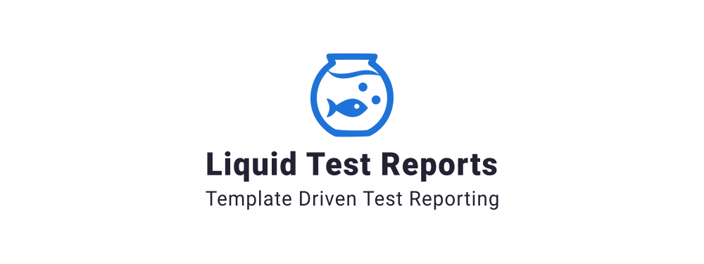

Liquid Test Reports are logger extensions for the [Visual Studio Test Platform](https://gtihub.com/microsoft/vstest) that provide flexible test report generation using liquid templates. This project contains an extensible core for code based extension, a custom logger for providing your own templates without code, and a Markdown implementation.

## Changelog

#### v0.1.4

**Added**

- [Markdown] Option to exclude run messages from test report enabled through parameter
  `IncludeMessages=false;`

**Changed**

- [All] Update targets to .NET standard 2.1 / .NET framework 4.5.1+


## LiquidTestReports.Markdown
[](https://www.nuget.org/packages/LiquidTestReports.Markdown) 

The Markdown logger package is a ready to use  implementation of the test logger that generates Markdown format reports. 

[Sample Report](docs/samples/xUnit.md)

**How to use**:

1. Install the markdown logger to your test project by running the following command
	`dotnet add package LiquidTestReports.Core`
2. Run the tests using the supplied logger
	`dotnet test --logger "liquid.md"`
3. Report will be generated in the test results folder


## LiquidTestReports.Custom
[](https://www.nuget.org/packages/LiquidTestReports.Custom)

The custom logger package allows you to create your own reports simply by passing the file path of the template to the test logger. The current documentation is still in progress, a list of template properties are available [here](docs/Properties.md). 

[Sample Report](docs/samples/xUnit.txt) (using example template below)

**How to use:**

1. Install the core logger to your test project either using the nuget or by running the following command
	
	`dotnet add package LiquidTestReports.Custom`

2. Add a new text file to your test project, and set `Copy to Output Directory` as`Copy always`, below is a starting sample template

  ```TemplateExample.txt
  Test Statistics:
  
  None: {{ run.test_run_statistics.none_count }}
  Passed: {{ run.test_run_statistics.passed_count }}
  Failed: {{ run.test_run_statistics.failed_count }}
  Skipped: {{ run.test_run_statistics.skipped_count }}
  Not Found: {{ run.test_run_statistics.not_found_count }}
  Total: {{ run.test_run_statistics.executed_tests_count }}
  
  ```

3. Run the tests using the supplied logger

	`dotnet test --logger "liquid.custom;TemplateExample.txt"`

4. Report will be generated in the test results folder


More liquid template documentation is available on the [Shopify Github](https://shopify.github.io/liquid/basics/introduction/).

### LiquidTestReports.Core
[](https://www.nuget.org/packages/LiquidTestReports.Core)

The core project is utilised by the above two loggers and can be used to implement your own, however, this is yet to be documented. The custom and markdown implementations provide an guide of how to implement this.

**How to install**:

1. Install the core logger to your test project either using the nuget or by running the following command

	`dotnet add package LiquidTestReports.Core`


## License

LiquidTestReports is under [BSD 2-Clause License.](https://github.com/kurtmkurtm/LiquidTestReports/blob/master/LICENSE)

This library utilises the following libraries under the Apache 2.0 license

- **DotLiquid** - https://github.com/dotliquid/dotliquid/blob/master/LICENSE.txt

This library utilises the following libraries under the MIT License

- **Microsoft - VSTest** - https://github.com/microsoft/vstest/blob/master/LICENSE

